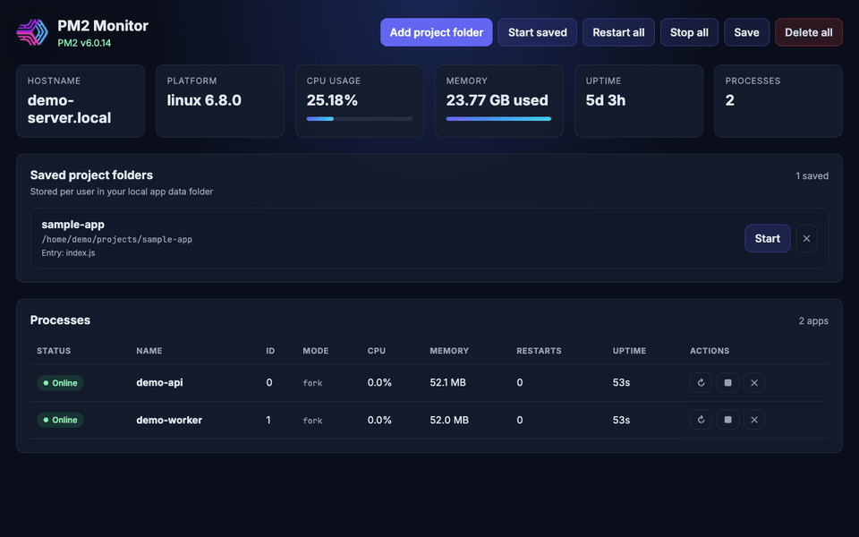

pm2-gui [](http://badge.fury.io/js/pm2-gui)
=======

An elegant web and terminal interface for [PM2](https://pm2.keymetrics.io/).

> Compatible with **PM2 5.x, 6.x, and 7.x** (Node.js 18+)



# What's new in 0.2.0

- Uses the official **PM2 programmatic API** instead of legacy axon RPC sockets
- Modernized web dashboard (responsive layout, dark theme, process table, detail modal)
- Updated stack: Socket.IO 4, Pug templates, Express 4
- Fixed process monitor socket event mismatch from the legacy UI

# Guide

- [Features](#features)
- [Requirements](#requirements)
- [Installation](#installation)
- [Usage](#usage)
- [Configuration](#configuration)
- [Authorization](#authorization)
- [UI](#ui)

<a name="features"></a>
# Features

- Web dashboard for monitoring and controlling PM2 processes
- Curses-like terminal dashboard (`pm2-gui mon`)
- Real-time system CPU and memory stats
- Real-time process list with restart/stop/delete/save actions
- Per-process detail view with info, live CPU/memory chart, and log tailing
- Remote agent mode for monitoring multiple hosts
- ANSI-colored logs via [ansi-html](https://github.com/Tjatse/ansi-html)

<a name="requirements"></a>
# Requirements

- Node.js **18+**
- PM2 installed and running (`npm install -g pm2` then `pm2 ls`)

<a name="installation"></a>
# Installation

```bash
npm install pm2-gui -g
pm2-gui start

# or from source
git clone https://github.com/Tjatse/pm2-gui.git
cd pm2-gui
npm install
npm start
```

<a name="usage"></a>
# Usage

```bash
pm2-gui start [config.ini]   # Web server + monitor (default port 8088)
pm2-gui agent [config.ini]   # Socket.IO agent only (remote monitoring)
pm2-gui mon [config.ini]     # Terminal dashboard
```

Programmatic API:

```javascript
const pm2GUI = require('pm2-gui')
pm2GUI.startWebServer('./pm2-gui.ini')
pm2GUI.startAgent('./pm2-gui.ini')
pm2GUI.dashboard('./pm2-gui.ini')
```

<a name="configuration"></a>
# Configuration

Edit `pm2-gui.ini` (or pass a custom path):

```ini
pm2 = ~/.pm2
port = 8088
refresh = 5s
process_refresh = 3s
readonly = false

[agent]
; authorization = your-secret-token

[remotes]
; server1 = auth-token@192.168.1.10:8088
```

<a name="authorization"></a>
# Authorization

Set `[agent].authorization` in the config file. Clients must pass `?auth=TOKEN` when connecting via Socket.IO, and complete the web login form for HTTP access.

<a name="ui"></a>
# UI

Open `http://127.0.0.1:8088` after starting the server.

The dashboard shows:

- Host metrics (CPU, memory, uptime)
- Process table with status badges and inline actions
- Process detail modal with info, live monitor chart, and log streaming

Legacy screenshots are still available in [`screenshots/`](screenshots/).

## Test

```bash
npm test
```

## License

MIT — Copyright (c) 2014-2016 Tjatse
